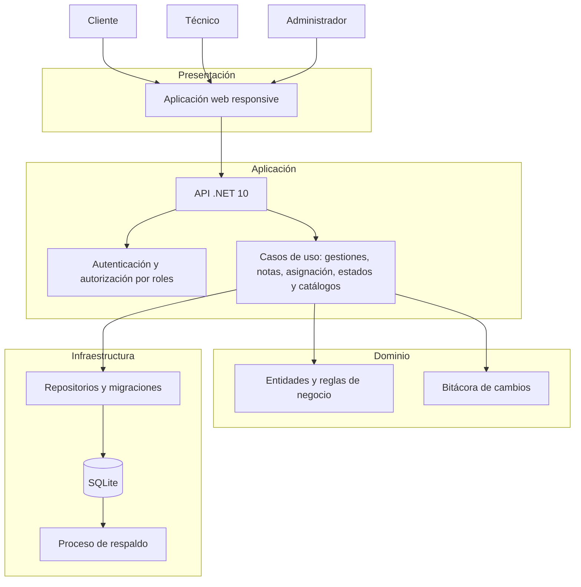

# Project Canvas — Sistema de Gestión de Solicitudes Low Code / No Code
## Entregable del Kickoff — SOFT-734, Tema 3, Práctica 3

**Equipo (integrantes):**
- Kimberly
- Randall
- Mayra
- Marco

**Nombre tentativo del proyecto:** GestionaLCNC

---

### 1. Problema / idea de negocio

Las solicitudes internas de automatización y soluciones digitales (RPA, BPM y Power Platform) se reciben hoy por correo, mensajería y documentos dispersos. Esto impide priorizarlas de forma consistente, dificulta conocer su estado y deja la trazabilidad de decisiones y atenciones incompleta.

**Solución propuesta:** GestionaLCNC será una aplicación web interna que centralice el registro, asignación, seguimiento y auditoría de solicitudes. Cada solicitud tendrá un flujo de estados, responsable técnico, historial cronológico y notas con visibilidad pública o interna.

**Validación asistida por IA:** la idea ataca un problema operativo concreto: el uso de canales no estructurados aumenta reprocesos, solicitudes duplicadas y falta de evidencia para auditoría. El MVP es viable porque concentra primero el flujo esencial de punta a punta antes de incorporar integraciones externas o automatizaciones avanzadas.

### 2. Usuarios / a quién sirve

| Usuario | Necesidad principal | Valor que recibe |
|---|---|---|
| Cliente o solicitante interno | Registrar y consultar una necesidad de automatización | Seguimiento transparente, responsable asignado y acceso a las comunicaciones públicas de su caso. |
| Técnico de RPA, BPM o Power Platform | Gestionar la bandeja de solicitudes asignadas y documentar la atención | Priorización, contexto centralizado y trazabilidad de las acciones realizadas. |
| Administrador del proceso | Gobernar la operación, asignar trabajo y administrar catálogos | Control global, auditoría, balance de carga e indicadores operativos. |

### 3. Historias de usuario clave (generadas y refinadas con IA)

1. **HU-CLI-01:** Como cliente, quiero registrar una solicitud con los campos requeridos, para iniciar formalmente la atención de una necesidad de automatización.
2. **HU-CLI-02:** Como cliente, quiero consultar mis solicitudes por estado, para conocer su avance en tiempo real.
3. **HU-TEC-02:** Como técnico, quiero cambiar el estado de una gestión según reglas definidas, para reflejar el progreso real de la atención.
4. **HU-TEC-04:** Como técnico, quiero marcar notas como públicas o internas, para comunicar al cliente cuando corresponda y reservar coordinación interna.
5. **HU-ADM-02:** Como administrador, quiero asignar o reasignar técnicos a una gestión, para balancear carga y cumplir tiempos de atención.

**Criterios transversales para las historias del MVP:** se validan campos obligatorios en interfaz y backend; las acciones relevantes registran usuario y fecha; y la autorización por rol impide que el cliente consulte notas internas o solicitudes ajenas.

### 4. Ambigüedades o riesgos detectados con ayuda de IA

| Ambigüedad o riesgo | Impacto | Decisión o mitigación propuesta |
|---|---|---|
| Estados oficiales y transiciones aún no aprobados; no está clara la diferencia entre cerrar, rechazar y anular. | Podría producir reglas contradictorias, datos inconsistentes y retrabajo. | Definir y aprobar en la Fase 0 una matriz de estados, transiciones, responsables y motivos obligatorios. Para el MVP se propone: Registrada, Asignada, En atención, En espera, Resuelta, Cerrada y Anulada. |
| No está definida la regla de solicitudes duplicadas. | Se pueden atender dos veces casos equivalentes o bloquear solicitudes válidas. | Iniciar con una advertencia basada en solicitante, tipo y ventana temporal; validar con negocio antes de convertirla en bloqueo o fusión automática. |
| La visibilidad exacta de las notas internas requiere definición. | Existe riesgo de exponer información de coordinación interna al cliente o a personal no autorizado. | Aplicar por defecto acceso solo para técnico asignado y administrador; incluir pruebas de autorización por rol y registrar accesos/cambios relevantes. |
| SQLite puede ser insuficiente ante crecimiento de volumen o concurrencia. | Riesgo de bloqueos de escritura y degradación de consultas. | Usar SQLite solo en el piloto, medir volumen y concurrencia, realizar respaldos y definir un umbral de migración a una base de datos de servidor. |
| Edición simultánea de una gestión por diferentes usuarios. | Puede causar pérdida de información o sobrescritura de cambios. | Implementar concurrencia optimista y mostrar un conflicto para que el usuario recargue y concilie los cambios. |

### 5. Arquitectura inicial

La propuesta sigue Clean Architecture para separar las reglas de negocio de la interfaz y de los detalles de persistencia.

**Crítica de arquitectura asistida por IA:**

| Hallazgo | Tipo | Tratamiento inicial |
|---|---|---|
| SQLite concentra la persistencia en un único archivo y puede bloquear escrituras concurrentes. | Cuello de botella y punto único de falla. | Respaldos verificados, acceso mediante repositorios, concurrencia optimista y plan de migración a PostgreSQL o SQL Server si se supera el umbral definido. |
| Una única instancia de la aplicación web o API puede dejar el sistema fuera de servicio. | Punto único de falla. | Para el MVP, monitoreo y procedimiento de recuperación; para crecimiento, despliegue de múltiples instancias detrás de un balanceador y base de datos de servidor. |
| El módulo de autorización protege notas internas y acciones administrativas. | Riesgo de seguridad de alto impacto. | Aplicar autorización por acción, pruebas de seguridad por rol, bitácora de accesos y principio de mínimo privilegio. |
| Los dashboards pueden competir con las consultas operativas si procesan todos los históricos en tiempo real. | Cuello de botella potencial. | Paginar y filtrar consultas, crear índices adecuados y usar agregados o actualización periódica si el volumen crece. |

### 6. Integraciones de IA previstas

| Integración del menú | Uso concreto en el proyecto | Control humano |
|---|---|---|
| Ideación | Refinar el problema, los actores, el alcance MVP y las alternativas de solución. | El equipo valida que las propuestas respeten el proceso real de RPA, BPM y Power Platform. |
| Planificación | Descomponer el backlog en fases, priorizar historias y reconocer dependencias y riesgos. | El equipo estima esfuerzo y aprueba el alcance de cada iteración. |
| Diseño | Proponer arquitectura inicial, modelos de dominio, matriz de permisos y diagramas Mermaid. | Se revisan decisiones de seguridad, escalabilidad y cumplimiento antes de implementarlas. |
| Codificación | Acelerar la creación de capas .NET, casos de uso, validaciones y componentes de interfaz. | Revisión de código, compilación y cumplimiento de Clean Architecture. |
| Pruebas | Generar escenarios, casos borde y pruebas unitarias/integración para roles, estados y notas. | Se ejecutan las pruebas y se revisa su cobertura y relevancia. |
| Depuración | Analizar errores, trazas y fallos de pruebas durante el desarrollo. | El equipo reproduce el problema y valida que la corrección no genere regresiones. |

### 7. Reparto de trabajo inicial

| Responsable | Trabajo inicial | Entregables o evidencia |
|---|---|---|
| Kimberly | Análisis funcional y gestión del backlog. Cerrar ambigüedades de proceso, definir estados, campos obligatorios y criterios de aceptación. | Historias priorizadas, matriz de estados/permisos y registro de decisiones. |
| Randall | Arquitectura y backend. Crear la solución .NET 10, modelo de dominio, casos de uso, persistencia SQLite, auditoría y seguridad por roles. | Diagrama actualizado, migraciones, API/casos de uso y pruebas unitarias. |
| Mayra | Interfaz y experiencia. Desarrollar pantallas responsive, validaciones de frontend y el prototipo navegable. | Prototipo funcional, pantallas de consulta/creación/detalle y validaciones de captura. |
| Marco | Integraciones de IA, dashboards, calidad y documentación. Gestionar la evidencia de uso de IA, los dashboards base, las pruebas end-to-end/UAT y la documentación de despliegue. | Evidencia de prompts y DECISIONES_IA, resultados UAT, checklist de salida y documentación técnica. |
| Todo el equipo | Revisar entregables generados con IA, decidir el MVP, realizar revisiones de código y validar con usuarios de negocio. | Actas de revisión, backlog refinado y aprobación de UAT. |

### 8. Próximos pasos del kickoff

1. Validar el canvas con las personas dueñas del proceso.
2. Resolver las ambigüedades críticas de estados, duplicados, permisos y visibilidad de notas.
3. Aprobar el alcance exacto del MVP y convertir las historias priorizadas en tareas técnicas.
4. Iniciar la Fase 1 con la solución .NET 10, autenticación, modelo de datos y migraciones.
